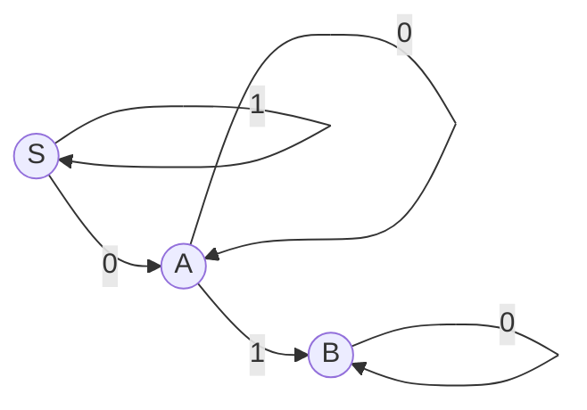

# 2021 zyj期中

一、

S是起始，S A B都是终止

（1）转为右线性文法

（2）转为正则式

二、
$$
S\rightarrow iEtSA|aA \\
A\rightarrow eS|\varepsilon \\
E\rightarrow b|\varepsilon
$$

（1）写出非终结符的FIRST集和FOLLOW集

（2）写出句子$iEtSA$和$ibtaeSA$的句柄

（3）判断是否是LL(1)文法，如果是，写出分析表

（4）判断是否是SLR(1)文法，如果是，写出分析表

三、
$$
S\rightarrow bD|Seb\\
D\rightarrow a|aa
$$
（1）拓广文法

（2）写出LR(1)项目集规范族

（3）写出LR(1)分析表

（4）判断是否是LALR(1)文法